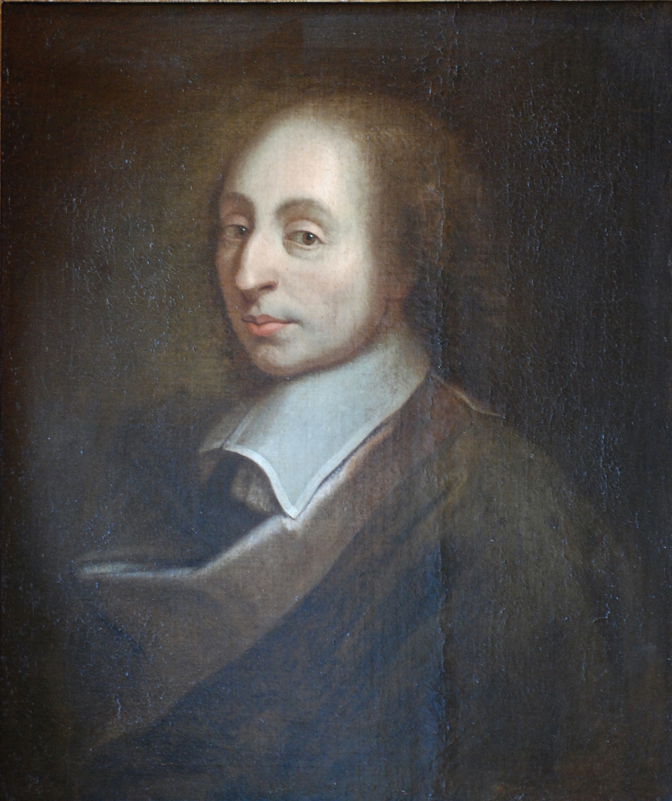

# 帕斯卡计算器（Pascal's Calculator）

布莱士‧帕斯卡（Blaise Pascal，1623年6月19日－1662年8月19日），法国神学家、哲学家、数学家、物理学家、化学家、音乐家、教育家、气象学家。帕斯卡早期进行自然和应用科学的研究，对机械计算器的制造和流体的研究作出重要贡献，扩展托里切利的工作，澄清了压强和真空的概念。帕斯卡还有力地为科学方法辩护。数学上，帕斯卡促成了两个重要的新研究领域。他16岁写出一篇题为射影几何的论文，1654年开始与皮埃尔·德·费马通信，讨论概率论，深刻影响了现代经济学和社会科学的发展。

