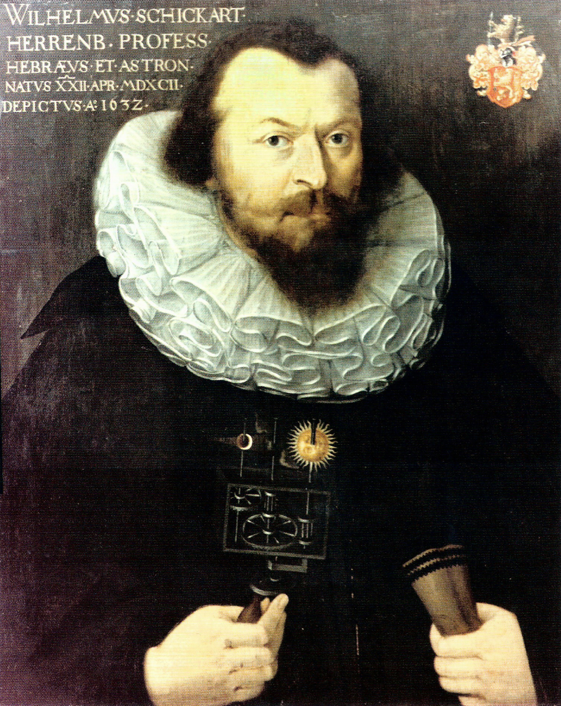

# 契克卡德计算器(Schickard Calculating Machine)

契克卡德（ Wilhelm Schickard ），1592年4月22日，出生于[德国巴登-符腾堡州的黑伦贝格](https://goo.gl/maps/qRNeWREZdQutAE746)，在蒂宾根大学接受教育，于 1609 年获得学士学位，1611 年获得硕士学位，从 1613 年开始，开始在蒂宾根大学学习神学跟东方语言，同年成为成为路德教部长（Lutheran minister）并一直持续到 1619 年，蒂宾根大学任命他为希伯来教授。

